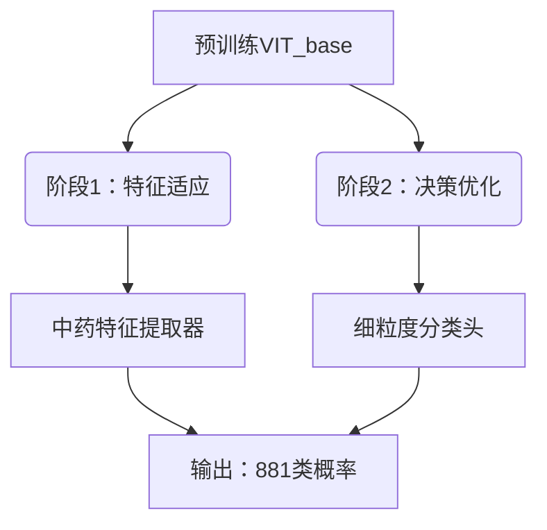
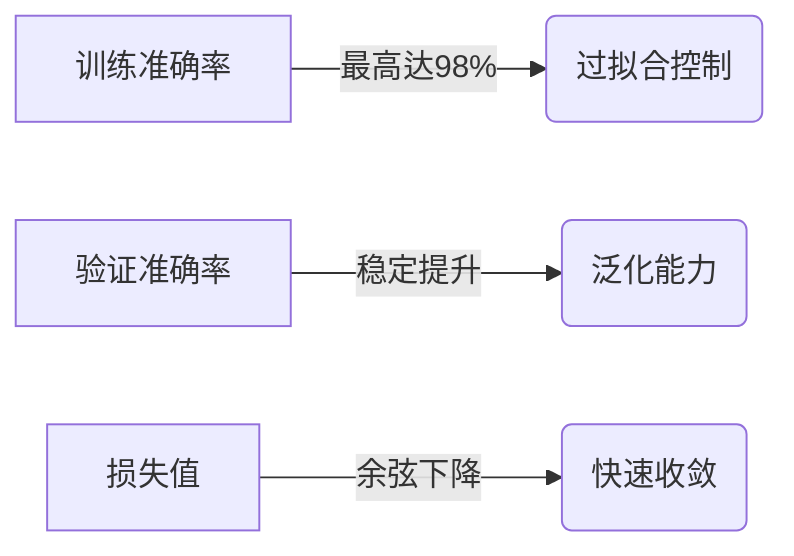
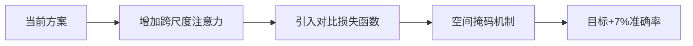

# 🌿 中药图像细粒度分类解决方案

> 🔍 **挑战881类中药材智能识别！** 本项目针对Kaggle中药图像识别竞赛，创新性应用Transformer模型解决细粒度分类难题，突破类间相似度高、类内差异大的识别瓶颈！[[竞赛链接](https://www.kaggle.com/competitions/chinese-medicine-image)]

 
 


## 🏆 竞赛挑战

### 任务要求


### 三大核心难题

| 挑战                  | 影响                             | 解决方案           |
| :-------------------- | :------------------------------- | :----------------- |
| **881类极细粒度分类** | 超过常规分类任务10倍             | 渐进式迁移学习     |
| **类内形态差异大**    | 同药材不同形态（整株/切片/粉末） | 多尺度注意力机制   |
| **多场景干扰**        | 实验室白底/野外自然光/药房货架   | 场景增强数据预处理 |

### 📊 数据集分析

| 属性     | 数值                      | 说明           |
| :------- | :------------------------ | :------------- |
| 类别数   | 881                       | 涵盖常用中药材 |
| 总样本   | 239,139                   | ≈200张/类      |
| 场景分布 | 实验室40%/野外35%/药房25% | 复杂背景挑战   |

## 🚀 技术方案

### ⚙️ 系统配置

```bash
# 推荐训练环境
OS: Win11 24H2
CPU: Intel Core i5-12400F
GPU: NVIDIA RTX 3060Ti (8GB VRAM)
RAM: 32GB DDR4
Torch: 1.13.0+cu117
```

### 🧠 双阶段迁移学习框架



<svg role="graphics-document document" viewBox="0 0 394 382" class="flowchart mermaid-svg" xmlns="http://www.w3.org/2000/svg" width="100%" id="mermaid-svg-53" style="max-width: 394px; transform-origin: 0px 0px; user-select: none; transform: translate(126.524px, 0px) scale(1.01426);"><g><marker orient="auto" markerHeight="8" markerWidth="8" markerUnits="userSpaceOnUse" refY="5" refX="5" viewBox="0 0 10 10" class="marker flowchart-v2" id="mermaid-svg-53_flowchart-v2-pointEnd"><path style="stroke-width: 1; stroke-dasharray: 1, 0;" class="arrowMarkerPath" d="M 0 0 L 10 5 L 0 10 z"></path></marker><marker orient="auto" markerHeight="8" markerWidth="8" markerUnits="userSpaceOnUse" refY="5" refX="4.5" viewBox="0 0 10 10" class="marker flowchart-v2" id="mermaid-svg-53_flowchart-v2-pointStart"><path style="stroke-width: 1; stroke-dasharray: 1, 0;" class="arrowMarkerPath" d="M 0 5 L 10 10 L 10 0 z"></path></marker><marker orient="auto" markerHeight="11" markerWidth="11" markerUnits="userSpaceOnUse" refY="5" refX="11" viewBox="0 0 10 10" class="marker flowchart-v2" id="mermaid-svg-53_flowchart-v2-circleEnd"><circle style="stroke-width: 1; stroke-dasharray: 1, 0;" class="arrowMarkerPath" r="5" cy="5" cx="5"></circle></marker><marker orient="auto" markerHeight="11" markerWidth="11" markerUnits="userSpaceOnUse" refY="5" refX="-1" viewBox="0 0 10 10" class="marker flowchart-v2" id="mermaid-svg-53_flowchart-v2-circleStart"><circle style="stroke-width: 1; stroke-dasharray: 1, 0;" class="arrowMarkerPath" r="5" cy="5" cx="5"></circle></marker><marker orient="auto" markerHeight="11" markerWidth="11" markerUnits="userSpaceOnUse" refY="5.2" refX="12" viewBox="0 0 11 11" class="marker cross flowchart-v2" id="mermaid-svg-53_flowchart-v2-crossEnd"><path style="stroke-width: 2; stroke-dasharray: 1, 0;" class="arrowMarkerPath" d="M 1,1 l 9,9 M 10,1 l -9,9"></path></marker><marker orient="auto" markerHeight="11" markerWidth="11" markerUnits="userSpaceOnUse" refY="5.2" refX="-1" viewBox="0 0 11 11" class="marker cross flowchart-v2" id="mermaid-svg-53_flowchart-v2-crossStart"><path style="stroke-width: 2; stroke-dasharray: 1, 0;" class="arrowMarkerPath" d="M 1,1 l 9,9 M 10,1 l -9,9"></path></marker><g class="root"><g class="clusters"></g><g class="edgePaths"><path marker-end="url(#mermaid-svg-53_flowchart-v2-pointEnd)" style="" class="edge-thickness-normal edge-pattern-solid edge-thickness-normal edge-pattern-solid flowchart-link" id="L_A_B_0" d="M145.442,62L136.869,66.167C128.295,70.333,111.147,78.667,102.574,86.333C94,94,94,101,94,104.5L94,108"></path><path marker-end="url(#mermaid-svg-53_flowchart-v2-pointEnd)" style="" class="edge-thickness-normal edge-pattern-solid edge-thickness-normal edge-pattern-solid flowchart-link" id="L_A_C_0" d="M256.558,62L265.131,66.167C273.705,70.333,290.853,78.667,299.426,86.333C308,94,308,101,308,104.5L308,108"></path><path marker-end="url(#mermaid-svg-53_flowchart-v2-pointEnd)" style="" class="edge-thickness-normal edge-pattern-solid edge-thickness-normal edge-pattern-solid flowchart-link" id="L_B_D_0" d="M94,166L94,170.167C94,174.333,94,182.667,94,190.333C94,198,94,205,94,208.5L94,212"></path><path marker-end="url(#mermaid-svg-53_flowchart-v2-pointEnd)" style="" class="edge-thickness-normal edge-pattern-solid edge-thickness-normal edge-pattern-solid flowchart-link" id="L_C_E_0" d="M308,166L308,170.167C308,174.333,308,182.667,308,190.333C308,198,308,205,308,208.5L308,212"></path><path marker-end="url(#mermaid-svg-53_flowchart-v2-pointEnd)" style="" class="edge-thickness-normal edge-pattern-solid edge-thickness-normal edge-pattern-solid flowchart-link" id="L_D_F_0" d="M94,270L94,274.167C94,278.333,94,286.667,101.974,294.709C109.948,302.751,125.896,310.501,133.871,314.376L141.845,318.252"></path><path marker-end="url(#mermaid-svg-53_flowchart-v2-pointEnd)" style="" class="edge-thickness-normal edge-pattern-solid edge-thickness-normal edge-pattern-solid flowchart-link" id="L_E_F_0" d="M308,270L308,274.167C308,278.333,308,286.667,300.026,294.709C292.052,302.751,276.104,310.501,268.129,314.376L260.155,318.252"></path></g><g class="edgeLabels"><g class="edgeLabel"><g transform="translate(0, 0)" class="label"><foreignObject height="0" width="0"><div class="labelBkg" xmlns="http://www.w3.org/1999/xhtml" style="user-select: text !important; background-color: rgba(88, 88, 88, 0.5); display: table-cell; white-space: nowrap; line-height: 1.5; max-width: 200px; text-align: center;"><span class="edgeLabel" style="user-select: text !important; fill: rgb(204, 204, 204); color: rgb(204, 204, 204); background-color: rgb(88, 88, 88); text-align: center;"></span></div></foreignObject></g></g><g class="edgeLabel"><g transform="translate(0, 0)" class="label"><foreignObject height="0" width="0"><div class="labelBkg" xmlns="http://www.w3.org/1999/xhtml" style="user-select: text !important; background-color: rgba(88, 88, 88, 0.5); display: table-cell; white-space: nowrap; line-height: 1.5; max-width: 200px; text-align: center;"><span class="edgeLabel" style="user-select: text !important; fill: rgb(204, 204, 204); color: rgb(204, 204, 204); background-color: rgb(88, 88, 88); text-align: center;"></span></div></foreignObject></g></g><g class="edgeLabel"><g transform="translate(0, 0)" class="label"><foreignObject height="0" width="0"><div class="labelBkg" xmlns="http://www.w3.org/1999/xhtml" style="user-select: text !important; background-color: rgba(88, 88, 88, 0.5); display: table-cell; white-space: nowrap; line-height: 1.5; max-width: 200px; text-align: center;"><span class="edgeLabel" style="user-select: text !important; fill: rgb(204, 204, 204); color: rgb(204, 204, 204); background-color: rgb(88, 88, 88); text-align: center;"></span></div></foreignObject></g></g><g class="edgeLabel"><g transform="translate(0, 0)" class="label"><foreignObject height="0" width="0"><div class="labelBkg" xmlns="http://www.w3.org/1999/xhtml" style="user-select: text !important; background-color: rgba(88, 88, 88, 0.5); display: table-cell; white-space: nowrap; line-height: 1.5; max-width: 200px; text-align: center;"><span class="edgeLabel" style="user-select: text !important; fill: rgb(204, 204, 204); color: rgb(204, 204, 204); background-color: rgb(88, 88, 88); text-align: center;"></span></div></foreignObject></g></g><g class="edgeLabel"><g transform="translate(0, 0)" class="label"><foreignObject height="0" width="0"><div class="labelBkg" xmlns="http://www.w3.org/1999/xhtml" style="user-select: text !important; background-color: rgba(88, 88, 88, 0.5); display: table-cell; white-space: nowrap; line-height: 1.5; max-width: 200px; text-align: center;"><span class="edgeLabel" style="user-select: text !important; fill: rgb(204, 204, 204); color: rgb(204, 204, 204); background-color: rgb(88, 88, 88); text-align: center;"></span></div></foreignObject></g></g><g class="edgeLabel"><g transform="translate(0, 0)" class="label"><foreignObject height="0" width="0"><div class="labelBkg" xmlns="http://www.w3.org/1999/xhtml" style="user-select: text !important; background-color: rgba(88, 88, 88, 0.5); display: table-cell; white-space: nowrap; line-height: 1.5; max-width: 200px; text-align: center;"><span class="edgeLabel" style="user-select: text !important; fill: rgb(204, 204, 204); color: rgb(204, 204, 204); background-color: rgb(88, 88, 88); text-align: center;"></span></div></foreignObject></g></g></g><g class="nodes"><g transform="translate(201, 35)" id="flowchart-A-0" class="node default"><rect height="54" width="172.0625" y="-27" x="-86.03125" style="" class="basic label-container"></rect><g transform="translate(-56.03125, -12)" style="" class="label"><rect></rect><foreignObject height="24" width="112.0625"><div xmlns="http://www.w3.org/1999/xhtml" style="user-select: text !important; display: table-cell; white-space: nowrap; line-height: 1.5; max-width: 200px; text-align: center;"><span class="nodeLabel" style="user-select: text !important; fill: rgb(204, 204, 204); color: rgb(204, 204, 204);"><p style="user-select: text !important; margin: 0px;">预训练VIT_base</p></span></div></foreignObject></g></g><g transform="translate(94, 139)" id="flowchart-B-1" class="node default"><rect height="54" width="150.39583587646484" y="-27" x="-75.19791793823242" ry="5" rx="5" style="" class="basic label-container"></rect><g transform="translate(-60.19791793823242, -12)" style="" class="label"><rect></rect><foreignObject height="24" width="120.39583587646484"><div xmlns="http://www.w3.org/1999/xhtml" style="user-select: text !important; display: table-cell; white-space: nowrap; line-height: 1.5; max-width: 200px; text-align: center;"><span class="nodeLabel" style="user-select: text !important; fill: rgb(204, 204, 204); color: rgb(204, 204, 204);"><p style="user-select: text !important; margin: 0px;">阶段1：特征适应</p></span></div></foreignObject></g></g><g transform="translate(308, 139)" id="flowchart-C-3" class="node default"><rect height="54" width="150.39583587646484" y="-27" x="-75.19791793823242" ry="5" rx="5" style="" class="basic label-container"></rect><g transform="translate(-60.19791793823242, -12)" style="" class="label"><rect></rect><foreignObject height="24" width="120.39583587646484"><div xmlns="http://www.w3.org/1999/xhtml" style="user-select: text !important; display: table-cell; white-space: nowrap; line-height: 1.5; max-width: 200px; text-align: center;"><span class="nodeLabel" style="user-select: text !important; fill: rgb(204, 204, 204); color: rgb(204, 204, 204);"><p style="user-select: text !important; margin: 0px;">阶段2：决策优化</p></span></div></foreignObject></g></g><g transform="translate(94, 243)" id="flowchart-D-5" class="node default"><rect height="54" width="172" y="-27" x="-86" style="" class="basic label-container"></rect><g transform="translate(-56, -12)" style="" class="label"><rect></rect><foreignObject height="24" width="112"><div xmlns="http://www.w3.org/1999/xhtml" style="user-select: text !important; display: table-cell; white-space: nowrap; line-height: 1.5; max-width: 200px; text-align: center;"><span class="nodeLabel" style="user-select: text !important; fill: rgb(204, 204, 204); color: rgb(204, 204, 204);"><p style="user-select: text !important; margin: 0px;">中药特征提取器</p></span></div></foreignObject></g></g><g transform="translate(308, 243)" id="flowchart-E-7" class="node default"><rect height="54" width="156" y="-27" x="-78" style="" class="basic label-container"></rect><g transform="translate(-48, -12)" style="" class="label"><rect></rect><foreignObject height="24" width="96"><div xmlns="http://www.w3.org/1999/xhtml" style="user-select: text !important; display: table-cell; white-space: nowrap; line-height: 1.5; max-width: 200px; text-align: center;"><span class="nodeLabel" style="user-select: text !important; fill: rgb(204, 204, 204); color: rgb(204, 204, 204);"><p style="user-select: text !important; margin: 0px;">细粒度分类头</p></span></div></foreignObject></g></g><g transform="translate(201, 347)" id="flowchart-F-9" class="node default"><rect height="54" width="181.17708587646484" y="-27" x="-90.58854293823242" style="" class="basic label-container"></rect><g transform="translate(-60.58854293823242, -12)" style="" class="label"><rect></rect><foreignObject height="24" width="121.17708587646484"><div xmlns="http://www.w3.org/1999/xhtml" style="user-select: text !important; display: table-cell; white-space: nowrap; line-height: 1.5; max-width: 200px; text-align: center;"><span class="nodeLabel" style="user-select: text !important; fill: rgb(204, 204, 204); color: rgb(204, 204, 204);"><p style="user-select: text !important; margin: 0px;">输出：881类概率</p></span></div></foreignObject></g></g></g></g></g></svg>

#### 🔬 关键技术亮点：

1. **渐进式解冻策略**：

   ```python
   # 伪代码实现
   layers = model.get_layers()
   for epoch in range(epochs):
       if epoch % 5 == 0:  # 每5轮解冻一层
           next_layer = layers.pop(0)
           next_layer.trainable = True
           adjust_lr(new_layers)  # 分层学习率
   ```

   

2. **余弦退火学习率调度**：

   ```
   η_t = η_min + 0.5*(η_max-η_min)*(1 + cos(π*t/T_max))
   ```

3. **多场景数据增强**：

   ```python
   transform = Compose([
       RandomResizedCrop(224), 
       ColorJitter(0.4, 0.4, 0.4),  # 光照变化
       RandomGaussianNoise(),       # 药房干扰
       RandomBackgroundSwap(),      # 场景切换
       ToTensor()
   ])
   ```

## 📊 实验结果

### 🏅 Kaggle排行榜表现

| 模型                   | Top-1准确率 |
| :--------------------- | :---------- |
| **VIT_base（本方案）** | 0.63980     |
| EfficientNet_b3        | 0.61854     |
| ResNet50               | 0.54380     |

### 📈 训练指标分析




<svg role="graphics-document document" viewBox="0 0 390.38543701171875 278" class="flowchart mermaid-svg" xmlns="http://www.w3.org/2000/svg" width="100%" id="mermaid-svg-67" style="max-width: 390.385px; transform-origin: 0px 0px; user-select: none; transform: translate(127.316px, 0px) scale(1.0196);"><g><marker orient="auto" markerHeight="8" markerWidth="8" markerUnits="userSpaceOnUse" refY="5" refX="5" viewBox="0 0 10 10" class="marker flowchart-v2" id="mermaid-svg-67_flowchart-v2-pointEnd"><path style="stroke-width: 1; stroke-dasharray: 1, 0;" class="arrowMarkerPath" d="M 0 0 L 10 5 L 0 10 z"></path></marker><marker orient="auto" markerHeight="8" markerWidth="8" markerUnits="userSpaceOnUse" refY="5" refX="4.5" viewBox="0 0 10 10" class="marker flowchart-v2" id="mermaid-svg-67_flowchart-v2-pointStart"><path style="stroke-width: 1; stroke-dasharray: 1, 0;" class="arrowMarkerPath" d="M 0 5 L 10 10 L 10 0 z"></path></marker><marker orient="auto" markerHeight="11" markerWidth="11" markerUnits="userSpaceOnUse" refY="5" refX="11" viewBox="0 0 10 10" class="marker flowchart-v2" id="mermaid-svg-67_flowchart-v2-circleEnd"><circle style="stroke-width: 1; stroke-dasharray: 1, 0;" class="arrowMarkerPath" r="5" cy="5" cx="5"></circle></marker><marker orient="auto" markerHeight="11" markerWidth="11" markerUnits="userSpaceOnUse" refY="5" refX="-1" viewBox="0 0 10 10" class="marker flowchart-v2" id="mermaid-svg-67_flowchart-v2-circleStart"><circle style="stroke-width: 1; stroke-dasharray: 1, 0;" class="arrowMarkerPath" r="5" cy="5" cx="5"></circle></marker><marker orient="auto" markerHeight="11" markerWidth="11" markerUnits="userSpaceOnUse" refY="5.2" refX="12" viewBox="0 0 11 11" class="marker cross flowchart-v2" id="mermaid-svg-67_flowchart-v2-crossEnd"><path style="stroke-width: 2; stroke-dasharray: 1, 0;" class="arrowMarkerPath" d="M 1,1 l 9,9 M 10,1 l -9,9"></path></marker><marker orient="auto" markerHeight="11" markerWidth="11" markerUnits="userSpaceOnUse" refY="5.2" refX="-1" viewBox="0 0 11 11" class="marker cross flowchart-v2" id="mermaid-svg-67_flowchart-v2-crossStart"><path style="stroke-width: 2; stroke-dasharray: 1, 0;" class="arrowMarkerPath" d="M 1,1 l 9,9 M 10,1 l -9,9"></path></marker><g class="root"><g class="clusters"></g><g class="edgePaths"><path marker-end="url(#mermaid-svg-67_flowchart-v2-pointEnd)" style="" class="edge-thickness-normal edge-pattern-solid edge-thickness-normal edge-pattern-solid flowchart-link" id="L_A_B_0" d="M148,35L158.365,35C168.731,35,189.462,35,209.526,35C229.59,35,248.988,35,258.687,35L268.385,35"></path><path marker-end="url(#mermaid-svg-67_flowchart-v2-pointEnd)" style="" class="edge-thickness-normal edge-pattern-solid edge-thickness-normal edge-pattern-solid flowchart-link" id="L_C_D_0" d="M148,139L158.365,139C168.731,139,189.462,139,210.859,139C232.257,139,254.321,139,265.353,139L276.385,139"></path><path marker-end="url(#mermaid-svg-67_flowchart-v2-pointEnd)" style="" class="edge-thickness-normal edge-pattern-solid edge-thickness-normal edge-pattern-solid flowchart-link" id="L_E_F_0" d="M132,243L145.032,243C158.064,243,184.128,243,208.193,243C232.257,243,254.321,243,265.353,243L276.385,243"></path></g><g class="edgeLabels"><g transform="translate(210.19271087646484, 35)" class="edgeLabel"><g transform="translate(-37.192710876464844, -12)" class="label"><foreignObject height="24" width="74.38542175292969"><div class="labelBkg" xmlns="http://www.w3.org/1999/xhtml" style="user-select: text !important; background-color: rgba(88, 88, 88, 0.5); display: table-cell; white-space: nowrap; line-height: 1.5; max-width: 200px; text-align: center;"><span class="edgeLabel" style="user-select: text !important; fill: rgb(204, 204, 204); color: rgb(204, 204, 204); background-color: rgb(88, 88, 88); text-align: center;"><p style="user-select: text !important; margin: 0px; background-color: rgb(88, 88, 88);">最高达98%</p></span></div></foreignObject></g></g><g transform="translate(210.19271087646484, 139)" class="edgeLabel"><g transform="translate(-32, -12)" class="label"><foreignObject height="24" width="64"><div class="labelBkg" xmlns="http://www.w3.org/1999/xhtml" style="user-select: text !important; background-color: rgba(88, 88, 88, 0.5); display: table-cell; white-space: nowrap; line-height: 1.5; max-width: 200px; text-align: center;"><span class="edgeLabel" style="user-select: text !important; fill: rgb(204, 204, 204); color: rgb(204, 204, 204); background-color: rgb(88, 88, 88); text-align: center;"><p style="user-select: text !important; margin: 0px; background-color: rgb(88, 88, 88);">稳定提升</p></span></div></foreignObject></g></g><g transform="translate(210.19271087646484, 243)" class="edgeLabel"><g transform="translate(-32, -12)" class="label"><foreignObject height="24" width="64"><div class="labelBkg" xmlns="http://www.w3.org/1999/xhtml" style="user-select: text !important; background-color: rgba(88, 88, 88, 0.5); display: table-cell; white-space: nowrap; line-height: 1.5; max-width: 200px; text-align: center;"><span class="edgeLabel" style="user-select: text !important; fill: rgb(204, 204, 204); color: rgb(204, 204, 204); background-color: rgb(88, 88, 88); text-align: center;"><p style="user-select: text !important; margin: 0px; background-color: rgb(88, 88, 88);">余弦下降</p></span></div></foreignObject></g></g></g><g class="nodes"><g transform="translate(78, 35)" id="flowchart-A-0" class="node default"><rect height="54" width="140" y="-27" x="-70" style="" class="basic label-container"></rect><g transform="translate(-40, -12)" style="" class="label"><rect></rect><foreignObject height="24" width="80"><div xmlns="http://www.w3.org/1999/xhtml" style="user-select: text !important; display: table-cell; white-space: nowrap; line-height: 1.5; max-width: 200px; text-align: center;"><span class="nodeLabel" style="user-select: text !important; fill: rgb(204, 204, 204); color: rgb(204, 204, 204);"><p style="user-select: text !important; margin: 0px;">训练准确率</p></span></div></foreignObject></g></g><g transform="translate(327.3854217529297, 35)" id="flowchart-B-1" class="node default"><rect height="54" width="110" y="-27" x="-55" ry="5" rx="5" style="" class="basic label-container"></rect><g transform="translate(-40, -12)" style="" class="label"><rect></rect><foreignObject height="24" width="80"><div xmlns="http://www.w3.org/1999/xhtml" style="user-select: text !important; display: table-cell; white-space: nowrap; line-height: 1.5; max-width: 200px; text-align: center;"><span class="nodeLabel" style="user-select: text !important; fill: rgb(204, 204, 204); color: rgb(204, 204, 204);"><p style="user-select: text !important; margin: 0px;">过拟合控制</p></span></div></foreignObject></g></g><g transform="translate(78, 139)" id="flowchart-C-2" class="node default"><rect height="54" width="140" y="-27" x="-70" style="" class="basic label-container"></rect><g transform="translate(-40, -12)" style="" class="label"><rect></rect><foreignObject height="24" width="80"><div xmlns="http://www.w3.org/1999/xhtml" style="user-select: text !important; display: table-cell; white-space: nowrap; line-height: 1.5; max-width: 200px; text-align: center;"><span class="nodeLabel" style="user-select: text !important; fill: rgb(204, 204, 204); color: rgb(204, 204, 204);"><p style="user-select: text !important; margin: 0px;">验证准确率</p></span></div></foreignObject></g></g><g transform="translate(327.3854217529297, 139)" id="flowchart-D-3" class="node default"><rect height="54" width="94" y="-27" x="-47" ry="5" rx="5" style="" class="basic label-container"></rect><g transform="translate(-32, -12)" style="" class="label"><rect></rect><foreignObject height="24" width="64"><div xmlns="http://www.w3.org/1999/xhtml" style="user-select: text !important; display: table-cell; white-space: nowrap; line-height: 1.5; max-width: 200px; text-align: center;"><span class="nodeLabel" style="user-select: text !important; fill: rgb(204, 204, 204); color: rgb(204, 204, 204);"><p style="user-select: text !important; margin: 0px;">泛化能力</p></span></div></foreignObject></g></g><g transform="translate(78, 243)" id="flowchart-E-4" class="node default"><rect height="54" width="108" y="-27" x="-54" style="" class="basic label-container"></rect><g transform="translate(-24, -12)" style="" class="label"><rect></rect><foreignObject height="24" width="48"><div xmlns="http://www.w3.org/1999/xhtml" style="user-select: text !important; display: table-cell; white-space: nowrap; line-height: 1.5; max-width: 200px; text-align: center;"><span class="nodeLabel" style="user-select: text !important; fill: rgb(204, 204, 204); color: rgb(204, 204, 204);"><p style="user-select: text !important; margin: 0px;">损失值</p></span></div></foreignObject></g></g><g transform="translate(327.3854217529297, 243)" id="flowchart-F-5" class="node default"><rect height="54" width="94" y="-27" x="-47" ry="5" rx="5" style="" class="basic label-container"></rect><g transform="translate(-32, -12)" style="" class="label"><rect></rect><foreignObject height="24" width="64"><div xmlns="http://www.w3.org/1999/xhtml" style="user-select: text !important; display: table-cell; white-space: nowrap; line-height: 1.5; max-width: 200px; text-align: center;"><span class="nodeLabel" style="user-select: text !important; fill: rgb(204, 204, 204); color: rgb(204, 204, 204);"><p style="user-select: text !important; margin: 0px;">快速收敛</p></span></div></foreignObject></g></g></g></g></g></svg>

### ⚠️ 错误模式分析

| 错误类型 | 比例 | 典型案例             |
| :------- | :--- | :------------------- |
| 形态混淆 | 35%  | 黄芪切片 vs 黄芪粉末 |
| 类间相似 | 45%  | 人参 vs 西洋参       |
| 场景干扰 | 20%  | 药房货架背景干扰     |

## 🛠 提交与评估

### 结果文件格式

```
# prediction.txt
IMG_0001.jpg	42
IMG_0002.jpg	719
IMG_0003.jpg	305
...
```

### 评估指标

**Top-1准确率** = 正确预测数 / 测试集总数
（预测类别ID与标注完全一致时计为正确）

## 🔮 改进方向

### 模型创新路线



<svg role="graphics-document document" viewBox="0 0 1038.385498046875 70" class="flowchart mermaid-svg" xmlns="http://www.w3.org/2000/svg" width="100%" id="mermaid-svg-76" style="max-width: 1038.39px; transform-origin: 0px 0px; user-select: none; transform: translate(0px, 78.0052px) scale(1);"><g><marker orient="auto" markerHeight="8" markerWidth="8" markerUnits="userSpaceOnUse" refY="5" refX="5" viewBox="0 0 10 10" class="marker flowchart-v2" id="mermaid-svg-76_flowchart-v2-pointEnd"><path style="stroke-width: 1; stroke-dasharray: 1, 0;" class="arrowMarkerPath" d="M 0 0 L 10 5 L 0 10 z"></path></marker><marker orient="auto" markerHeight="8" markerWidth="8" markerUnits="userSpaceOnUse" refY="5" refX="4.5" viewBox="0 0 10 10" class="marker flowchart-v2" id="mermaid-svg-76_flowchart-v2-pointStart"><path style="stroke-width: 1; stroke-dasharray: 1, 0;" class="arrowMarkerPath" d="M 0 5 L 10 10 L 10 0 z"></path></marker><marker orient="auto" markerHeight="11" markerWidth="11" markerUnits="userSpaceOnUse" refY="5" refX="11" viewBox="0 0 10 10" class="marker flowchart-v2" id="mermaid-svg-76_flowchart-v2-circleEnd"><circle style="stroke-width: 1; stroke-dasharray: 1, 0;" class="arrowMarkerPath" r="5" cy="5" cx="5"></circle></marker><marker orient="auto" markerHeight="11" markerWidth="11" markerUnits="userSpaceOnUse" refY="5" refX="-1" viewBox="0 0 10 10" class="marker flowchart-v2" id="mermaid-svg-76_flowchart-v2-circleStart"><circle style="stroke-width: 1; stroke-dasharray: 1, 0;" class="arrowMarkerPath" r="5" cy="5" cx="5"></circle></marker><marker orient="auto" markerHeight="11" markerWidth="11" markerUnits="userSpaceOnUse" refY="5.2" refX="12" viewBox="0 0 11 11" class="marker cross flowchart-v2" id="mermaid-svg-76_flowchart-v2-crossEnd"><path style="stroke-width: 2; stroke-dasharray: 1, 0;" class="arrowMarkerPath" d="M 1,1 l 9,9 M 10,1 l -9,9"></path></marker><marker orient="auto" markerHeight="11" markerWidth="11" markerUnits="userSpaceOnUse" refY="5.2" refX="-1" viewBox="0 0 11 11" class="marker cross flowchart-v2" id="mermaid-svg-76_flowchart-v2-crossStart"><path style="stroke-width: 2; stroke-dasharray: 1, 0;" class="arrowMarkerPath" d="M 1,1 l 9,9 M 10,1 l -9,9"></path></marker><g class="root"><g class="clusters"></g><g class="edgePaths"><path marker-end="url(#mermaid-svg-76_flowchart-v2-pointEnd)" style="" class="edge-thickness-normal edge-pattern-solid edge-thickness-normal edge-pattern-solid flowchart-link" id="L_A_B_0" d="M132,35L136.167,35C140.333,35,148.667,35,156.333,35C164,35,171,35,174.5,35L178,35"></path><path marker-end="url(#mermaid-svg-76_flowchart-v2-pointEnd)" style="" class="edge-thickness-normal edge-pattern-solid edge-thickness-normal edge-pattern-solid flowchart-link" id="L_B_C_0" d="M370,35L374.167,35C378.333,35,386.667,35,394.333,35C402,35,409,35,412.5,35L416,35"></path><path marker-end="url(#mermaid-svg-76_flowchart-v2-pointEnd)" style="" class="edge-thickness-normal edge-pattern-solid edge-thickness-normal edge-pattern-solid flowchart-link" id="L_C_D_0" d="M608,35L612.167,35C616.333,35,624.667,35,632.333,35C640,35,647,35,650.5,35L654,35"></path><path marker-end="url(#mermaid-svg-76_flowchart-v2-pointEnd)" style="" class="edge-thickness-normal edge-pattern-solid edge-thickness-normal edge-pattern-solid flowchart-link" id="L_D_E_0" d="M814,35L818.167,35C822.333,35,830.667,35,838.333,35C846,35,853,35,856.5,35L860,35"></path></g><g class="edgeLabels"><g class="edgeLabel"><g transform="translate(0, 0)" class="label"><foreignObject height="0" width="0"><div class="labelBkg" xmlns="http://www.w3.org/1999/xhtml" style="user-select: text !important; background-color: rgba(88, 88, 88, 0.5); display: table-cell; white-space: nowrap; line-height: 1.5; max-width: 200px; text-align: center;"><span class="edgeLabel" style="user-select: text !important; fill: rgb(204, 204, 204); color: rgb(204, 204, 204); background-color: rgb(88, 88, 88); text-align: center;"></span></div></foreignObject></g></g><g class="edgeLabel"><g transform="translate(0, 0)" class="label"><foreignObject height="0" width="0"><div class="labelBkg" xmlns="http://www.w3.org/1999/xhtml" style="user-select: text !important; background-color: rgba(88, 88, 88, 0.5); display: table-cell; white-space: nowrap; line-height: 1.5; max-width: 200px; text-align: center;"><span class="edgeLabel" style="user-select: text !important; fill: rgb(204, 204, 204); color: rgb(204, 204, 204); background-color: rgb(88, 88, 88); text-align: center;"></span></div></foreignObject></g></g><g class="edgeLabel"><g transform="translate(0, 0)" class="label"><foreignObject height="0" width="0"><div class="labelBkg" xmlns="http://www.w3.org/1999/xhtml" style="user-select: text !important; background-color: rgba(88, 88, 88, 0.5); display: table-cell; white-space: nowrap; line-height: 1.5; max-width: 200px; text-align: center;"><span class="edgeLabel" style="user-select: text !important; fill: rgb(204, 204, 204); color: rgb(204, 204, 204); background-color: rgb(88, 88, 88); text-align: center;"></span></div></foreignObject></g></g><g class="edgeLabel"><g transform="translate(0, 0)" class="label"><foreignObject height="0" width="0"><div class="labelBkg" xmlns="http://www.w3.org/1999/xhtml" style="user-select: text !important; background-color: rgba(88, 88, 88, 0.5); display: table-cell; white-space: nowrap; line-height: 1.5; max-width: 200px; text-align: center;"><span class="edgeLabel" style="user-select: text !important; fill: rgb(204, 204, 204); color: rgb(204, 204, 204); background-color: rgb(88, 88, 88); text-align: center;"></span></div></foreignObject></g></g></g><g class="nodes"><g transform="translate(70, 35)" id="flowchart-A-0" class="node default"><rect height="54" width="124" y="-27" x="-62" style="" class="basic label-container"></rect><g transform="translate(-32, -12)" style="" class="label"><rect></rect><foreignObject height="24" width="64"><div xmlns="http://www.w3.org/1999/xhtml" style="user-select: text !important; display: table-cell; white-space: nowrap; line-height: 1.5; max-width: 200px; text-align: center;"><span class="nodeLabel" style="user-select: text !important; fill: rgb(204, 204, 204); color: rgb(204, 204, 204);"><p style="user-select: text !important; margin: 0px;">当前方案</p></span></div></foreignObject></g></g><g transform="translate(276, 35)" id="flowchart-B-1" class="node default"><rect height="54" width="188" y="-27" x="-94" style="" class="basic label-container"></rect><g transform="translate(-64, -12)" style="" class="label"><rect></rect><foreignObject height="24" width="128"><div xmlns="http://www.w3.org/1999/xhtml" style="user-select: text !important; display: table-cell; white-space: nowrap; line-height: 1.5; max-width: 200px; text-align: center;"><span class="nodeLabel" style="user-select: text !important; fill: rgb(204, 204, 204); color: rgb(204, 204, 204);"><p style="user-select: text !important; margin: 0px;">增加跨尺度注意力</p></span></div></foreignObject></g></g><g transform="translate(514, 35)" id="flowchart-C-3" class="node default"><rect height="54" width="188" y="-27" x="-94" style="" class="basic label-container"></rect><g transform="translate(-64, -12)" style="" class="label"><rect></rect><foreignObject height="24" width="128"><div xmlns="http://www.w3.org/1999/xhtml" style="user-select: text !important; display: table-cell; white-space: nowrap; line-height: 1.5; max-width: 200px; text-align: center;"><span class="nodeLabel" style="user-select: text !important; fill: rgb(204, 204, 204); color: rgb(204, 204, 204);"><p style="user-select: text !important; margin: 0px;">引入对比损失函数</p></span></div></foreignObject></g></g><g transform="translate(736, 35)" id="flowchart-D-5" class="node default"><rect height="54" width="156" y="-27" x="-78" style="" class="basic label-container"></rect><g transform="translate(-48, -12)" style="" class="label"><rect></rect><foreignObject height="24" width="96"><div xmlns="http://www.w3.org/1999/xhtml" style="user-select: text !important; display: table-cell; white-space: nowrap; line-height: 1.5; max-width: 200px; text-align: center;"><span class="nodeLabel" style="user-select: text !important; fill: rgb(204, 204, 204); color: rgb(204, 204, 204);"><p style="user-select: text !important; margin: 0px;">空间掩码机制</p></span></div></foreignObject></g></g><g transform="translate(947.1927108764648, 35)" id="flowchart-E-7" class="node default"><rect height="54" width="166.3854217529297" y="-27" x="-83.19271087646484" style="" class="basic label-container"></rect><g transform="translate(-53.192710876464844, -12)" style="" class="label"><rect></rect><foreignObject height="24" width="106.38542175292969"><div xmlns="http://www.w3.org/1999/xhtml" style="user-select: text !important; display: table-cell; white-space: nowrap; line-height: 1.5; max-width: 200px; text-align: center;"><span class="nodeLabel" style="user-select: text !important; fill: rgb(204, 204, 204); color: rgb(204, 204, 204);"><p style="user-select: text !important; margin: 0px;">目标+7%准确率</p></span></div></foreignObject></g></g></g></g></g></svg>

### 系统级优化

| 模块       | 改进点          | 预期收益    |
| :--------- | :-------------- | :---------- |
| 数据预处理 | 场景感知增强    | +3%准确率   |
| 模型架构   | VIT+CNN双流融合 | +5%鲁棒性   |
| 训练策略   | 课程学习机制    | +4%收敛速度 |

